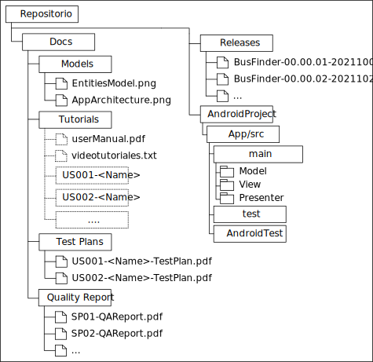

================================
 Estructura de los Repositorios
================================

Para favorecer la gestión de los diferentes artefactos creados durante la ejecución del proyecto, los repositorios asociados a cada proyecto deberán seguir la estructura que se muestra en la Figura 1. De acuerdo con dicha figura, cada repositorio  contendrá tres carpetas o directorios principales: ``Docs``, ``Releases`` y ``AndroidProject``. Cada uno de estos directorios almacenará el siguiente contenido.

``Docs``
  Contendrá toda la documentación técnica generada durante el desarrollo del proyecto.

``Releases``
  Almacenará los diferentes ejecutables generados al final de cada sprint.

``AndroidProject``
  Contendrá todo el código fuente asociado al proyecto, incluyendo el código correspondiente a los casos de prueba.

Cada carpeta se estructura a su vez tal como se indica en las siguientes secciones.

   Figura 1. Estructura de los Repositorios

Carpeta ``Docs``
=================

La carpeta ``Docs`` es la que aloja toda la documentación técnica generada durante el desarrollo proyecto. Esta carpeta contendrá las subcarpetas que se detallan a continuación.

.. note:: En cada una de estas carpetas podrán existir, además de los archivos indicados, todos los ficheros fuentes, como documentos de *Word* o *LibreOffice*, que sean necesarios para generar los documentos que se solicitan.

Carpeta ``Mockups``
--------------------

.. note:: Esta carpeta es opcional. No obstante, se recomienda encarecidamente su utilización.

Esta carpeta contendrá una carpeta por cada historia de usuario desarrollada. Cada carpeta se nombrará de acuerdo con el patrón ``US<id>-<Name>``, donde ``id`` es el identificador numérico asignado por *ScrumDesk* a dicha historia de usuario;  y ``name`` es un nombre que permita identificar dicha historia de usuario más cómodamente.

Dentro de cada una de estas subcarpetas se alojarán todos los *mockups* asociados a  la historia de usuario que corresponda. Se recomienda almacenar los *mockups* como imágenes ``.png``, dándoles un nombre significativo a cada una de ellas.

Carpeta ``Models``
--------------------

Esta carpeta contendrá todos los modelos generados durante el desarrollo de la aplicación.

Como mínimo, esta carpeta deberá contener:

  #. Un modelo de dominio, representado como un diagrama de clases UML, con las entidades que constituyen el *modelo* de la aplicación.
  #. Un modelo que describa la arquitectura de la aplicación, resaltando las conexiones entre las clases de la *vista*, el *modelo*, y el *presentador*; mediante un diagrama de clases UML.

Ambos modelos se almacenarán como imágenes en formato ``.png``. El fichero correspondiente al modelo de dominio deberá llamarse ``DomainModel.png``, mientras que el modelo arquitectónico tendrá como nombre ``AppArchitecture.png``.

En caso de que el equipo haya generado un modelo de objetivos, deberá alojarlo también en esta carpeta como un conjunto de imágenes en formato ``.png``. Cada imagen tendrá como nombre ``GoalModelXX.png``, donde ``XX`` se sustituirá por un identificador numérico autoincrementado comenzando en 0.

Carpeta ``Tutorials``
----------------------

Esta carpeta poseerá todo el material relacionado con el manual de usuario de la aplicación. Para elaborar el manual de usuario, se puede seguir cualquiera de las tres estrategias que se describen a continuación:

  #. Generar un manual de usuario clásico en formato ``pdf``.
  #. Elaborar una página web de ayuda donde la ayuda para cada historia de usuario se describa en una entrada diferente de dicha página.
  #. Crear una serie de videotutoriales, uno por cada historia de usuario, que ilustren el funcionamiento de la aplicación.

Manual de Usuario Clásico
^^^^^^^^^^^^^^^^^^^^^^^^^^

En este caso la carpeta ``Tutorials`` contendrá un único documento denominado ``userManual.pdf``, que corresponderá con el manual de usuario de la aplicación, organizado de la manera que cada equipo considere más conveniente.

Manual de Usuario HTML
^^^^^^^^^^^^^^^^^^^^^^^

En este caso existirá una página de inicio para el manual, denominada ``index.html``, que estará situada en la carpeta ``Tutorials``, más una página de ayuda independiente por cada historia de usuario desarrollada. Cada una de estas páginas de ayudas independientes contendrá las instrucciones necesarias para ejecutar una historia de usuario concreta.

De esta forma, la página de inicio deberá contener sólo una lista de enlaces, uno por cada historia de usuario desarrollada, y donde cada enlace apuntará a la página de ayuda de su correspondiente historia de usuario.

La página correspondiente a cada historia de usuario se alojará dentro de una subcarpeta de tutorials cuyo nombre seguirá el patrón ``US<id>-<Name>``, donde ``id`` es el identificador numérico asignado por *ScrumDesk* a dicha historia de usuario;  y, ``name`` es un nombre que permita identificar dicha historia de usuario de manera más cómoda.

Por último, destacar que dentro de la carpeta ``Tutorials`` y de las subcarpetas correspondientes a cada historia de usuario, podrán existir, además, otros tipos de archivos necesarios para la elaboración de cada página web, tales como hojas de estilo o imágenes.

.. Poner un ejemplo de página de ayuda

Videotutoriales
^^^^^^^^^^^^^^^^

En este caso, se elaborará un pequeño videotutorial por cada historia de usuario desarrollada. El vídeotutorial correspondiente a cada historia de usuario se alojará dentro de una subcarpeta de ``Tutorials`` cuyo nombre seguirá el patrón ``US<id>-<Name>``, donde ``id`` es el identificador numérico asignado por *ScrumDesk* a dicha historia de usuario  y ``name`` es un nombre que permita identificar dicha historia de usuario de manera más cómoda.

Como formato para los vídeos se puede escoger aquél que cada *Scrum Team* considere como más adecuado. En cualquier caso, se recomienda utilizar formatos sencillos que no impliquen la instalación de exóticos juegos de *codecs*.

Carpeta ``Test Plans``
-----------------------

Esta carpeta contendrá toda la documentación relacionada con las pruebas asociadas a cada historia de usuario. Por cada historia de usuario desarrollada se generarán dos documentos de pruebas: el *plan de pruebas* y el *informe de pruebas*. Ambos documentos deberán estar en formato ``pdf``. El *plan de pruebas* tendrá como nombre ``US<id>-<Name>-TestPlan.pdf``,  y el *informe de pruebas*, ``US<id>-<Name>-TestReport.pdf``. En ambos casos, ``id`` es el identificador numérico asignado por *ScrumDesk* a dicha historia de usuario; y, ``name`` es un nombre que permita identificar dicha historia de usuario de manera más cómoda.

Carpeta ``Quality Reports``
----------------------------

Esta carpeta alojará los informes de calidad generados para cada historia de usuario desarrollada. Los informes de calidad deberán estar en formato ``pdf``, y nombrados conformes al patrón ``US<id>-<Name>-QAReport.pdf``, donde ``id`` es el identificador numérico asignado por *ScrumDesk* a dicha historia de usuario  y ``name`` es un nombre que permita identificar dicha historia de usuario de manera más cómoda.

Carpeta ``Releases``
=====================

Esta carpeta contendrá los archivos binarios necesarios para instalar la versión del producto generada al final de cada sprint. En nuestro caso concreto, dicho archivo será un fichero ``apk``. Cada fichero ``apk`` generado al final de un sprint se nombrará con acuerdo al patrón ``<AppName><XX.YY.ZZ>.yy-mm-dd.apk``, donde ``AppName`` es el nombre de la aplicación desarrollada, ``XX.YY.ZZ`` el número de versión de acuerdo con el esquema de versionado del proyecto integrado, e ``yy-mm-dd`` la fecha, en formato anglosajón, correspondiente a la *Product Review* del sprint donde se generó dicho ``apk``.

Carpeta ``AndroidProject``
===========================

Este directorio contendrá el código fuente de la aplicación, incluyendo también el código correspondiente a los casos de prueba.

Esta carpeta se organizará en subcarpetas y paquetes de acuerdo a los convenios habituales de Java y Android. En cualquier caso, cada elemento del patrón *Modelo-Vista-Presentador (MVP)* se alojará en un paquete separado.

Igualmente, los paquetes destinados a alojar los test deberán seguir una estructura de subpaquetes y clases lógica. En el caso de los test unitarios, se debe seguir la misma estructura de paquetes que existe en el código fuente. Para el caso de los test de integración, se deberá crear un paquete por cada historia de usuario, y alojar todos los test asociados a dicha historia de usuario en ese paquete. Cada clase y método de prueba deberá tener una referencia clara al escenario que se prueba. La relación entre la implementación de cada prueba y su definición debe ser lo más clara y unívoca posible.
