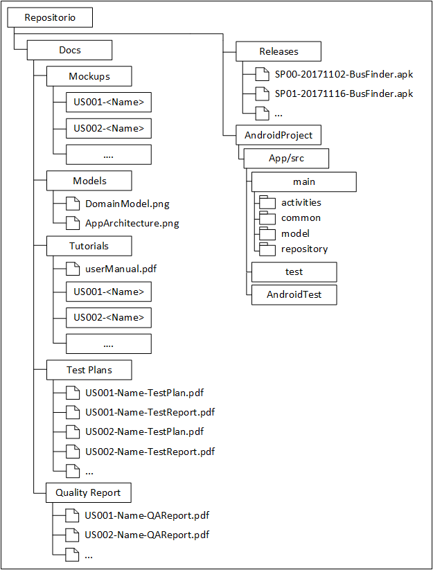

================================
 Estructura de los Repositorios
================================

Para favorecer la gestión de los diferentes artefactos creados durante la ejecución del proyecto integrado, los repositorios asociados a cada proyecto deberán seguir la estructura que se muestra en la Figura 1. De acuerdo con dicha figura, cada repositorio  contendrá tres carpetas o directorios principales: ``Docs``, ``Releases`` y ``AndroidProject``. Cada carpeta tendrá el propósito y estructura que se indica en las siguientes secciones.

   Figura 1. Estructura de los Repositorios

Carpeta ``Docs``
=================

La carpeta ``Docs`` es la que aloja toda la documentación técnica generada durante el desarrollo proyecto. Esta carpeta contendrá las subcarpetas que se detallan a continuación.

.. note:: En cada una de estas carpetas podrán existir, además de los archivos indicados, todos los ficheros fuentes, como documentos de *Word* o *LibreOffice*, que sean necesarios para generar los documentos que se solicitan.

Carpeta ``Models``
--------------------

Esta carpeta contendrá todos los modelos generados durante el desarrollo de la aplicación.

Como mínimo, esta carpeta deberá contener:

  #. Un modelo de clases UML con las entidades que constituyen el *modelo* de la aplicación.
  #. Un modelo que describa la arquitectura de la aplicación, resaltando las conexiones entre las clases de la *vista*, el *modelo*, y el *presentador*; mediante un diagrama de clases UML.

Ambos modelos se almacenarán en forma de modelo MagicDraw.

Carpeta ``Tutorials``
----------------------

Esta carpeta poseerá todo el material relacionado con el manual de usuario de la aplicación. Para elaborar el manual de usuario, se deberá seguir una única estrategia de las tres que se describen a continuación:

  #. Generar un manual de usuario clásico en formato ``pdf``.
  #. Elaborar una página web de ayuda donde la ayuda para cada historia de usuario se describa en una entrada diferente de dicha página.
  #. Crear una serie de videotutoriales, uno por cada historia de usuario, que ilustren el funcionamiento de la aplicación.

Manual de Usuario Clásico
^^^^^^^^^^^^^^^^^^^^^^^^^^

En este caso la carpeta ``Tutorials`` contendrá un único documento denominado ``userManual.pdf``, que contendrá el manual de usuario de la aplicación. Este manual estará estructurado internamente como cada equipo considere más conveniente.

Manual de Usuario HTML
^^^^^^^^^^^^^^^^^^^^^^^

En este caso existirá una página de inicio para el manual, denominada ``index.html``, que estará situada en la carpeta ``Tutorials``, más una página de ayuda independiente por cada historia de usuario desarrollada. Cada una de estas páginas de ayudas independientes contendrá las instrucciones necesarias para ejecutar una historia de usuario concreta. De esta forma, la página de inicio actuará simplemente como un índice donde se listen los enlaces a las páginas de ayuda de cada historia de usuario desarrollada.

La página correspondiente a cada historia de usuario se alojará dentro de una subcarpeta de ``Tutorials`` cuyo nombre seguirá el patrón ``US<id>-<Name>``, donde ``id`` es el identificador numérico asignado por *ScrumDesk* a dicha historia de usuario;  y, ``Name`` es un nombre que permita identificar dicha historia de usuario de manera más cómoda.

Por último, destacar que dentro de la carpeta ``Tutorials`` y de las subcarpetas correspondientes a cada historia de usuario, podrán existir, además, otros tipos de archivos necesarios para la elaboración de cada página web, tales como hojas de estilo o imágenes.

Videotutoriales
^^^^^^^^^^^^^^^^

En este caso, se creará un fichero de texto denominado ``videotutoriales.txt`` que proporcione, por cada historia de usuario desarrollada, un enlace al  videotutorial para esa historia de usuario. Este videotutorial deberá estar alojado en una plataforma externa universalmente accesible, como pueden ser *OneDrive*, *YouTube* o *Vimeo*.  El fichero ``videotutoriales.txt`` estará compuesta por una serie de entradas, una por cada línea, donde cada entrada deberá ser conforme al patrón ``US<id>-<Name>:<link>``, donde ``id`` es el identificador numérico asignado por *ScrumDesk* a dicha historia de usuario, ``Name`` es un nombre que permita identificar dicha historia de usuario de manera más cómoda, y ``<link>`` es una URL con el enlace al correspondiente videotutorial. Como formato para los vídeos se puede escoger aquél que cada *Scrum Team* considere como más adecuado. En cualquier caso, se recomienda utilizar formatos sencillos que no impliquen la instalación de exóticos juegos de *codecs*.

Carpeta ``Test Plans``
-----------------------

Esta carpeta contendrá toda la documentación relacionada con las pruebas asociadas a cada historia de usuario. Por cada historia de usuario desarrollada se generarán un *plan de pruebas*, que deberá estar en formato ``pdf``. El *plan de pruebas* tendrá como nombre ``US<id>-<Name>-TestPlan.pdf`` donde ``id`` es el identificador numérico asignado por *ScrumDesk* a dicha historia de usuario; y, ``Name`` es un nombre que permita identificar dicha historia de usuario de manera más cómoda.

Carpeta ``Quality Reports``
----------------------------

Esta carpeta alojará los informes de calidad generados para cada *sprint*. Los informes de calidad deberán estar en formato ``pdf``, y nombrados conformes al patrón ``SP<id>-QAReport.pdf``, donde ``id`` es el identificador numérico asignado a dicho *sprint*.

Carpeta ``Releases``
=====================

Esta carpeta contendrá los archivos binarios necesarios para instalar la versión del producto generada al final de cada *sprint*. En el caso concreto, dicho archivo será un fichero ``apk``. Cada fichero ``apk`` generado al final de un *sprint* se nombrará con acuerdo al patrón ``<AppName>-<XX.YY.ZZ>.yy-mm-dd.apk``, donde ``AppName`` es el nombre de la aplicación desarrollada, ``XX.YY.ZZ`` el número de versión de acuerdo con el esquema de versionado del proyecto integrado, e ``yy-mm-dd`` la fecha, en formato anglosajón, correspondiente a la *Product Review* del *sprint* donde se generó dicho ``apk``.

Carpeta ``AndroidProject``
===========================

.. _nomenclatura y organizacion de las clases de prueba: ../tests/index.html#nomenclatura-y-organizacion-de-las-clases-de-prueba

Este directorio contendrá el código fuente de la aplicación, incluyendo también el código correspondiente a los casos de prueba.

Esta carpeta se organizará en subcarpetas y paquetes de acuerdo a los convenios habituales de Java y Android. En cualquier caso, cada elemento del patrón *Modelo-Vista-Presentador (MVP)* se alojará en un paquete separado.

Igualmente, los paquetes destinados a alojar los test deberán seguir una estructura de subpaquetes y clases lógica. Esta estructura se describe en el apartado `nomenclatura y organizacion de las clases de prueba`_
