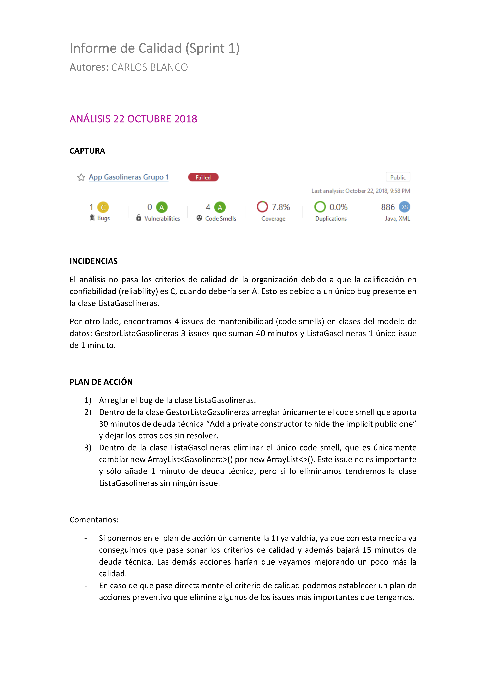

===============================
  Gestión de la Calidad
===============================

Introducción
===================

La aplicación Android desarrollada como proyecto integrado de las asignaturas de intensificación de Ingeniería del Software, ha de satisfacer unos umbrales de calidad mínimos. Por lo tanto, dentro de las tareas a realizar habrá que analizar la calidad de producto y llevar a cabo las correcciones necesarias para que cumpla los criterios de calidad.

Como herramienta utilizaremos SonarQube, que realiza análisis estático del código fuente detectando aspectos como código clonado, concordancia con estándares de programación, búsqueda de bugs o cobertura de pruebas. A cada uno de estos aspectos detectados, le asigna un valor de tiempo llamado “deuda técnica”, que podríamos definir como el coste y los intereses a pagar por hacer las cosas funcionales pero con poca calidad (el sobre esfuerzo a pagar por mantener un software mal hecho). Hay que tener en cuenta que sólo una parte de esta deuda es intrínseca al código y podemos medirla mediante analizadores, y que también puede venir asociada a aspectos relacionados con el proceso, arquitectura, diseño, tecnologías, etc.

Dispondremos de un servidor donde alojar los informes de los análisis de nuestro proyecto. Este servidor corresponde a la `organización isuc de  SonarCloud <https://sonarcloud.io/organizations/isuc/projects>`_ y en él están configurados los umbrales de calidad y el conjunto de reglas a usar en nuestros proyectos Android.
Por otro lado, en el cliente podremos lanzar el análisis de SonarQube mediante línea de comandos o de forma automatizada dentro del proceso de integración contínua. Además, dispondremos del complemento SonarLint para Android Studio que permitirá enlazar con la configuración de nuestro servidor y así gestionar las incidencias de forma cómoda desde nuestro IDE.

La manera de proceder será por sprint, de modo que para cada uno se designará una pareja de responsables de calidad. Dichos responsables deberán observar los análisis que aparecen en SonarCloud tras cada integración en la rama develop y observar si se cumplen o no los criterios de calidad exigidos. Si hay demasiadas integraciones en develop se podrá realizar un análisis de calidad cada 2 o 3 días.

Por cada análisis observado (cada integración), deberán analizar los datos y definir un plan de acciones que deberán realizar los desarrolladores para mejorar la calidad del código. Si el análisis indicaba que no se cumplen los criterios de calidad, el plan deberán incluir las acciones necesarias para pasarlo. Y en caso de que directamente se cumplan los criterios, el plan deberá incluir acciones preventivas para corregir los errores más importantes.

Configuración del servidor
=============================

Para utilizar SonarQube debemos tener por un lado un servidor donde se configurarán las reglas y umbrales a aplicar y se alojarán los distintos análisis realizados para cada proyecto. Por otro lado, se requiere de un cliente que analice el código y suba los resultados al servidor.

Podemos optar por instalar nuestro propio servidor utilizando las fuentes oficiales (existen versiones para distintos sistemas operativos) o utilizar servicios en la nube que lo proporcionan. Nosotros utilizaremos `SonarCloud <https://sonarcloud.io>`_, que es el servicio en la nube oficial y se ofrece de forma gratuita para proyectos públicos de código abierto. Dentro de SonarCloud hemos creado una organicación `isuc <https://sonarcloud.io/organizations/isuc/projects>`_ con todo lo necesario, así que únicamente deberéis compilar el proyecto con la configuración proporcionada, los análisis se subirán y podréis acceder a ellos en la dirección pública de la organización `isuc <https://sonarcloud.io/organizations/isuc/projects>`_.

Configuración del cliente
===============================

El analizador desde el cliente puede lanzarse desde línea de comandos o como parte del proceso de integración contínua. En ambos casos, la configuración necesaria para lanzar dichos análisis está proporcionada en el proyecto inicial aunque a continuación se detalla.

Tal y como puede observarse en el fichero de configuración ``gradle.build``, se hace uso del `complemento oficial de SonarQube para gradle <https://plugins.gradle.org/plugin/org.sonarqube>`_ y de una serie de propiedades que establecen datos como la url del servidor, la organización, en nombre y clave del proyecto y un token de autorización.

build.gradle (root)
-------------

::

    dependencies {
        classpath "com.android.tools.build:gradle:7.2.2"
        classpath "org.jacoco:org.jacoco.core:0.8.7"

build.gradle (app)
-------------

::

    plugins {
        id 'com.android.application'
        id "org.sonarqube" version "3.0"
    }

    apply plugin: "jacoco"

    jacoco {
        toolVersion = '0.8.7'
    }

    tasks.withType(Test) {
        jacoco.includeNoLocationClasses = true
        jacoco.excludes = ['jdk.internal.*'] // needed to support roboelectric with jacoco
    }

    task jacocoTestReport(type: JacocoReport, dependsOn: ['testDebugUnitTest']) {

        reports {
            xml.enabled = true
            html.enabled = true
        }

        def fileFilter = ['**/R.class', '**/R$*.class', '**/BuildConfig.*', '**/Manifest*.*', '**/*Test*.*', 'android/**/*.*']
        def mainSrc = "$project.projectDir/src/main/java"
        def javaTree = fileTree(dir: "$project.buildDir/intermediates/javac/debug/classes", excludes: fileFilter)

        sourceDirectories.setFrom(files([mainSrc]))
        classDirectories.setFrom(files([javaTree]))
        executionData.setFrom(fileTree(dir: project.buildDir, includes: ['jacoco/testDebugUnitTest.exec', 'outputs/code-coverage/connected/*coverage.ec']))
    }

    sonarqube {
        properties {
            property "sonar.host.url", "https://sonarcloud.io"
            property "sonar.organization", "isuc"
            property "sonar.login", "120537998e2c122476f30cade8d4a25865210fa6"
            property "sonar.projectKey", "App-Gasolineras-2022"
            property "sonar.projectName", "App-Gasolineras-2022"

            // I need this property to avoid the error where sonarqube does not close some files and
            // prevents a clean afterwards
            property "sonar.scm.disabled", true

            // this property is deprecated, now I use the xml file defined below it
            // property "sonar.jacoco.reportPaths", "${project.buildDir}/jacoco/testDebugUnitTest.exec"
            property "sonar.coverage.jacoco.xmlReportPaths", "${project.buildDir}/reports/jacoco/jacocoTestReport/jacocoTestReport.xml"
        }
    }

Complemento SonarLint para Android Studio
-----------------------------------------

Existe un complemento que podemos instalar en Android Studio para analizar la calidad del código, mostrándonos las incidencias con su clasificación (tipo, severidad, etc.), descripción de la regla que la ha activado, etc. Es bastante útil ya que nos permite seleccionar una incidencia e ir directamente a la parte del código donde se encuentra. Otra ventaja importante es que además de poder trabajar con una configuración por defecto, permite conectarnos a un servidor (propio o SonarCloud) y usar las reglas y quality gate configuradas para tu organización.

Para instalarlo la forma más sencilla es desde Preferencias -> Plugins -> Browse Repositories -> SonarLint, y al finalizar, reiniciar Android Studio. Debería aparecernos la pestaña de SonarLint en la parte baja de la interfaz.

Para la conexión con el servidor habrá que ir a Preferences -> Other Settings ->

*	SonarLint General Settings. Permitirá agregar el servidor SonarCloud o propio, meter nuestra clave y seleccionar nuestra organización (dichos valores aparecen en el fichero ``gradle.build``).

*	SonarLint Project Settings. Una vez realizado el paso anterior podremos seleccionar un proyecto en concreto.

Tras la configuración, podremos ejecutar análisis para un único fichero o el proyecto completo, mediante el menú contextual del proyecto (botón derecho) dentro de las opciones de SonarLint.

Análisis de la calidad de producto
========================================

Durante el proyecto integrado se realizarán *Sprints* en los que se desarrollarán varias historias de usuario. En cada Sprint se deberán realizar al menos 2 informes de calidad. Cada informe de calidad debe tener un responsable, que se encargará de realizarlo. Durante el transcurso del proyecto integrado, todos los integrantes deben haber sido responsables de al menos un informe.

Este responsable deberá realizar las acciones necesarias para que la codificación realizada cumpla con los umbrales de calidad establecidos, es decir, que pase de forma satisfactoria el *quality gate*.

El proceso que han de seguir los **responsables de realizar los informes** será el siguiente:

* Dentro del trabajo de cada *Sprint*, los desarrolladores trabajarán en varias historias de usuario que irán implementando en una determinada rama, realizando de forma periódica integraciones con la rama ``develop``. Al realizar cada integración en ``develop``, GitHub Actions lanzará un análisis de sonar cuyo resultado se alojará en el servidor de *SonarCloud* de *isuc*.

* El **responsable del informe** deberá observar el ``resultado del análisis`` para detectar si pasa o no las normas de calidad de la organización. Posteriormente, definirá un ``plan de acción`` a llevar a cabo (la serie de issues que deberán corregirse) para que el proyecto pase las normas de calidad de la organización. En caso de pasar las normas de calidad, el responsable del informe decidirá si hay aspectos que desean mejorar de forma preventiva.

* El responsable del informe de calidad comunicará a los desarrolladores el plan de acción a realizar y ellos deberán solventarlos. Idealmente, el siguiente informe deberá ver reflejado esta mejora en la calidad.

* En siguientes integraciones con la rama develop se procederá de igual forma, vigilando siempre que se satisfagan los criterios de calidad de la organización.

Informe de Calidad
===================

El informe indicará el estado de la calidad del producto según los resultados obtenidos por sonarcloud, y el plan de acción correspondiente.

Los informes de calidad deberán guardarse en el repositorio del grupo, en el directorio y el nombre determinados por la gestión de la configutración. El informe debe indicar el autor del mismo (el responsable), el Sprint en el que se realizó, y el número de informe dentro de dicho Sprint. 

El informe formará parte de la evaluación de la asignatura Calidad y Auditoría, correspondiendo a la parte de calidad de producto. Esta nota es individual. En caso de que algún integrante haya sido responsable de más de un informe de calidad, de cara a su evaluación sólo se tendrá en cuenta el último informe.

A continuación puede observarse un ejemplo de informe de calidad:

Análisis de la calidad de proceso
========================================

La forma en la que se ha realizado el producto (el proceso) representa otra dimensión de la calidad del software que debe ser analizada. La calidad de proceso está relacionada con la forma en la que se ha realizado, incluyendo especialmente aspectos metodológicos como la realización de diagramas, aplicación de técnicas, etc.

Existe cierta controversia en cuanto a si una buena calidad de proceso influye favorablemente en la obtención de una buena calidad de producto. Pensemos por ejemplo en la realización de un diagrama de clases (proceso) y si esto va a suponer que tengamos menos errores, vulnerabilidades, etc. en el código (producto interna). Existen defensores de ambas posiciones.

Dentro del proyecto integrado, se ha seguido una metodología concreta que abarca gestión de la configuración (ramas, integración continua, etc.), pruebas (plan, unitarias, integración. etc.), calidad de producto (proceso seguido, informes, etc.), documentación (diagramas, manuales, etc.), etc.

Una vez finalizados los sprints del proyecto integrado se procederá a un análisis de calidad del proceso seguido. Para ello distinguiremos dos etapas:

- Creación de una lista de comprobación. En esta fase, cada grupo deberá analizar la metodología seguida y pensar qué aspectos deberían comprobarse para saber si se ha aplicado correctamente el proceso solicitado. Con estos elementos confeccionará una lista de comprobación que servirá para auditar proyectos de este tipo.

- Auditorías cruzadas. Utilizando la lista de comprobación definida en la fase anterior, cada grupo realizará una auditoría del proceso seguido por otro grupo distinto.
